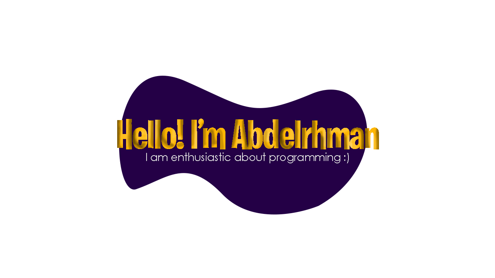

 
I'm a student at Faculty of Electronic Engineering.

** About me **

- 💼 Compitative Programming 
- 📈 Studying now Data Structure and Algrothims
- ❤️ I love sport and Games
- 💬  Ask me about anything [here](https://www.linkedin.com/in/sersawy/)

**Languages and Tools:**  
 
  
  <code></code>
  <code></code>
 

 
 

