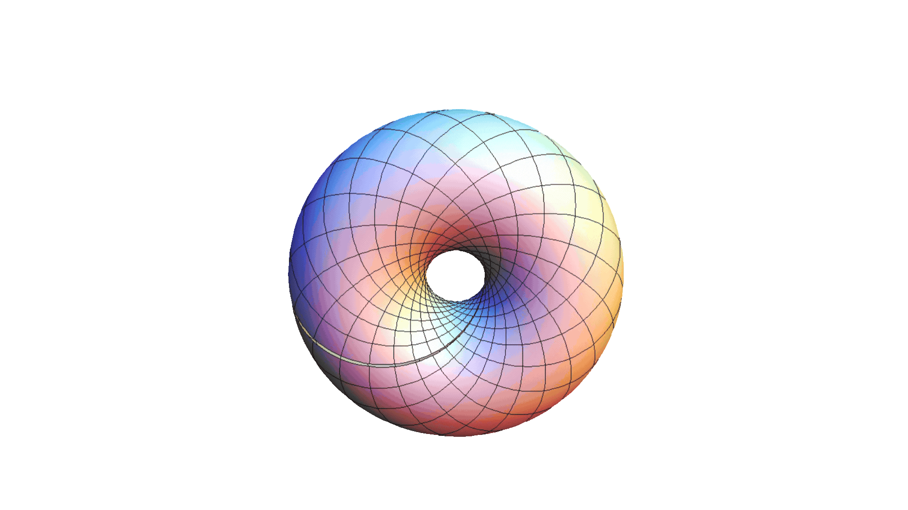

  
   
  <em>Bianchi-Pinkall Flat Tori</em>
  
My favorite geometric artwork. It represents the harmony between symmetry, topology, and continuous transformation.

I’m Abdelrhman Sersawy, a software developer and GNU/Linux enthusiast (Arch user 🙂) interested in database systems and backend engineering, especially how large-scale software works behind the scenes. I’m passionate about open source and actively contribute to projects in the PostgreSQL Community (pgmoneta, pgexporter, pgagroal), as well as Checkstyle and LLVM. [(See my contributions)](https://gist.github.com/Abdelrhmansersawy/e91d08f8495e5119e7d10859f0d60aa2).

Beyond that, I’m passionate about competitive programming - ICPC World Finalist 2026, (ECPC) National Gold Medalist, (ACPC) Regional Bronze Medalist, and a Master on Codeforces.

In my free time, I’m usually playing online chess (especially bullet 3+2) ♟️

### 📚 My Book library
* [The Internals of PostgreSQL](https://www.interdb.jp/pg/) : it’s about how PostgreSQL works internally—covering storage, query processing, transactions, and system architecture.
* [Designing Data-Intensive Applications](https://0-lucas.github.io/digital-garden/99.-Books/Martin-Kleppmann---Designing-Data-Intensive-Applications_-O%E2%80%99Reilly-Media-%282017%29.pdf) : it’s about building scalable, reliable data systems—databases, distributed systems, and data processing patterns.
* [The Rust Programming Language](https://doc.rust-lang.org/book/title-page.html): it’s about learning Rust fundamentals—ownership, memory safety, concurrency, and system-level programming.

### 📫 Reach Me

  

